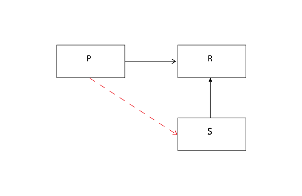
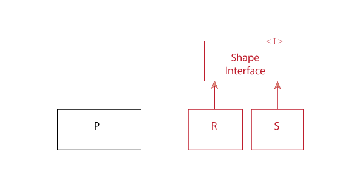

SOLID Principle 4

ISP - Interface Segregation Principle: CLIENTS SHOULD NOT BE FORCED TO DEPEND ON METHODS THAT THEY DO NOT USE.

So...last time in our saga of the SOLID principles we talked about The Liskov Substitution Principle and we ended with this situation...

We used an if statement...

	class Rectangle
	  attr_accessor :height, :width

	  def area
	    @height * @width
	  end
  
	end
	class Square < Rectangle
	  def height=(height)
	    @side = height
	  end

	  def width=(width)
	    @side = width
	  end

	  def area
	    @side * @side
	  end
	end

	class Program
	  def initialize(name, height, width)
	    if name == :square
	      @shape = Square.new
	      @shape.height = height
	    else
	      @shape = Rectangle.new
	      @shape.height = height
	      @shape.width = width
	    end
	  end

	  def area
	    @shape.area
	  end
	end

	
And this caused a violation of the LSP

diagram LSP_02

LSP violation

Program is directly asking if the returned value is an instance of Square. Our program requires direct knowledge of our derived subclass Square.
Subclass Square is thus not a proper substitute for Rectangle. And this is bad since it violate the LSP. So we need something that isolates 
SomeProgram from this knowledge of Square. We can use the Interface Segregation Principle to rescue this situation. 
So let's create our interfaces.

diagram ISP_02

Time for an abstract interface...let's think about the steps needed for this.

1. Create an interface for the Rectangle class.
2. Create an interface for the Program class.
3. Create an interface connecting the Program and Rectangle interfaces.

(For the sake of keeping the student's brain from being distracted by a new lanquage's syntax, 
I'm going to talk about this in terms of c++ in Ruby syntax.)
note: Ruby normaly doesn't have concreate interfaces...I'll talk about this in a moment.

So the first thing we do is create an interface for our Rectangle. After consideration we discover that an ideal solution is to create a 
Shapes interface that all shapes become subsets of. 

	class ShapeInterface
		def initialize(options)
		end
	
		def area
		end
	end

 
	class Rectangle < ShapeInterface
	  attr_accessor :height, :width
	  def initialize(options)
	    self.length = options.fetch(:height)
	    self.width  = options.fetch(:width)
	  end
  
	  def area
	    @length * @width
	  end
	end
	
	class Square < ShapeInterface
	  attr_accessor :height, :width
	  def initialize(options)
	    @side  = options.fetch(:height)
	    @side  = options.fetch(:width)
	  end
  
	  def area
	    @side * @side
	  end
	end
	

So now we have this (Red)

diagram ISP_03

And for our Program to Shape Interface...

	class ProgramShapeInterface 
	...
	end
 
	class ProgramInterface
	...
	end
 
	class Program < ProgramInterface
	...
	end
	
	square_area = Program.new "square", 4
	rectangle_area = Program.new "rectangle", 20, 4
	

And now our diagram looks like this

diagram ISP_04

and if we want even more shapes say a circle, we can just add a new Circle class

	class Circle < ShapeInterface
	  attr_accessor :radius
	  def initialize(options)
	    self.radius = options.fetch(:radius)
	  end
  
	  def area
	    2 * Math.pi * self.radius
	  end
	end

and our program can now generate a circle's area. 
	
	circle_area = Program.new "circle", 20

Now normally this problem would not be something a Ruby coder would worry about as Ruby does not have concreate interfaces. 
It's just done this way here to keep you the student from being bogged down by a new syntax. 
So don't get hung up over the actual code used here. Focus instead on the concept.

Conclusion:
Watch out for fat classes. When one client forces a change on a fat class, all other classes are affected. Thus, clients should only have to 
depend on methods that they actually call. This can be achieved by breaking the interface of the fat class into many client-specific interfaces.
Each client-specific interface declares only those functions that its particular client, or client group, invoke.

