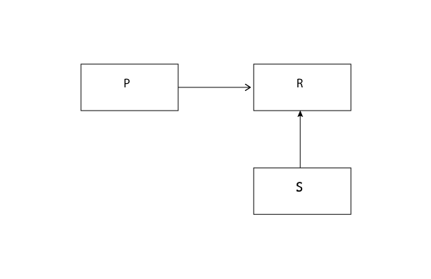
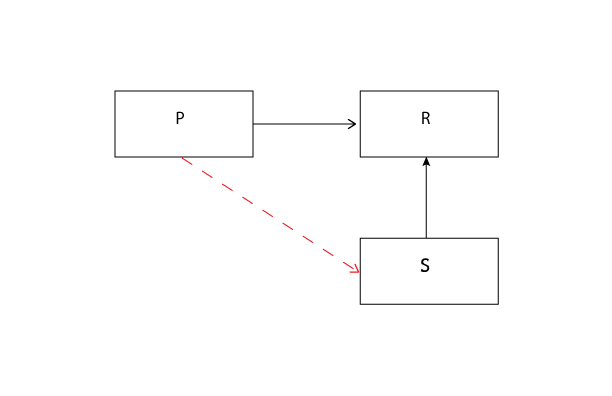

SOLID Principle 3

LSP - The Liskov Substitution Principle - SUBTYPES MUST BE SUBSTITUTABLE FOR THEIR BASE TYPES

Now in preparing for this post I've viewed Uncle Bob's videos on CleanCoder on the subject...correction, I 'experienced' 
Uncle Bob's videos on Clean Coder (chuckle) So let's see if I can communicate what I've learned to you.

In 1988 a rather awesome lady by the name of Barabara Liskov ([she's at mit](http://www.pmg.csail.mit.edu/~liskov/) so yes she gets the awesome moniker) came up 
with the idea that would be recoined as the [Liskov Substitution Principle](http://en.wikipedia.org/wiki/Liskov_substitution_principle). She stated the following...

If for each object O1 of type S there is an object O2 of type T such that for all programs P defined in terms of T, 
the behavior of P is unchanged when O1 is substituted for O2 then S is a subtype of T.

...now say that three times fast.

Let's try a different phrasing. SUBTYPES MUST BE SUBSTITUTABLE FOR THEIR BASE TYPES

Now what this looks like is represented in this UML Diagram

diagram LSP_01

So let's say Program = P, Rectangle = R and Square = S

Now this structure allows the Program(P) to use a Rectangle(R) and its subtype Square(S). 

**And here is the key part**. 

When accessing the subtype, Program(P) DOES NOT KNOW
it is accessing the subtype, this fact is transparent to Program. 

Now Let's say that our user uses Program to pass a height and width value to Rectangle in order to receive  
a rectangle in return...

	class Program
	... passes height and width to Rectangle class
	... receives Rectangle object
	end

And Rectangle looks like so...

	class Rectangle
	  attr_accessor :height, :width

	  def area
	    @height * @width
	  end
  
	end

	
And this works fine and dandy. We can make rectangles till we're blue in the face. 
And find their areas.

	rect = Rectangle.new
	rect.area(2,4) # => 8

	
But now our user wants SomeProgram to generate a square as well and we think to ourselves, well that's easy I'll just create 
a square class and have it inherit from the rectangle class.

	class Square < Rectangle
	end

But here is where our problems begin. Square is going to inherit both height and width from Rectangle. 
But what does it need both a width and height for? As a user I'm not going to ask for the program to pass back a square
with height=2 and width=2, that's counterintuitive, I'm going to want to send it only one value and I'll probably 
want to call it a side. So my square class will look something like this now....

	class Square < Rectangle
	  def height=(height)
	    @side = height
	  end

	  def width=(width)
	    @side = width
	  end

	  def area
	    @side * @side
	  end
	end

 
So What happens when the user submits only a changed width or only a changed height value to our program 
expecting a larger square in return?

She may receive a rectangle with the new value and NOT the expected square!

And this just won't do. We can't have our client receiving random rectangles. Her reaction will be that we the developers
don't know what we're doing.

So how do we resolve this?

Well the MOST common thing done is to simply ask the program what type of instance has been passed.

We use an if statement...

	class Program
	  def initialize(name, height, width)
	    if name == :square
	      @shape = Square.new
	      @shape.height = height
	    else
	      @shape = Rectangle.new
	      @shape.height = height
	      @shape.width = width
	    end
	  end

	  def area
	    @shape.area
	  end
	end

And BOOM we have just violated the LSP. Our program has to directly ask Rectangle about it's subtype Square. 
And if our subtype was originally a successfully crafted subtype, Program would not have to ever know of it's existence.

Recall our definition: 

LSP - The Liskov Substitution Principle - SUBTYPES MUST BE SUBSTITUTABLE FOR THEIR BASE TYPES

diagram LSP_02

LSP violation

So how do we solve this violation? We will talk about that in the next SOLID installment...The Interface Segregation Principle

